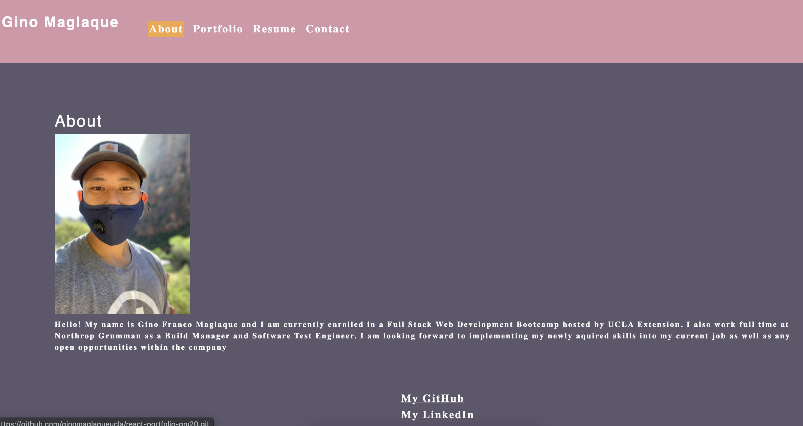

# React Portfolio

## Description
React Portfolio for Gino Franco Maglaque. This web application incorperates React's open-source front end and Javascript library. The portfolio presents a short bio (about), list of recent web development projects (portfolio), list of proficiencies and link to downloadable resume (resume), and contact form (contact)

## Table of Contents
* [Installation](#installation)
* [Usage](#usage)
* [License](#license)
* [Contribution](#contribution)
* [Test](#test)
* [Questions](#questions)

## Installation
1. Clone repository from (https://github.com/ginomaglaqueucla/react-portfolio-gm20.git) to local directory on computer.
2. Install packages (inquirer)

## Usage
1. Navigate to url
2. Click on each navigation section
3. Navigate to deployed projects and/or GitHub repositories
4. Navigate to Resume section, notice downloadable link
5. Navigate to Contact section

## License

MIT License

Copyright (c) [2020] [Gino Maglaque]

Permission is hereby granted, free of charge, to any person obtaining a copy of this software and associated documentation files (the "Software"), to deal in the Software without restriction, including without limitation the rights to use, copy, modify, merge, publish, distribute, sublicense, and/or sell copies of the Software, and to permit persons to whom the Software is furnished to do so, subject to the following conditions:

The above copyright notice and this permission notice shall be included in all copies or substantial portions of the Software.

## Contribution
Thie project uses the following external:
- React
- Helper functions via UCLABootCamp

To contribute to this project:
1. Clone repository from Installation section
2. Run npm install
3. Pull latest code locally, Create new working branch
4. Push up newly created branch
5. Create Pull Request and add reviewers when ready to merge with main code

## Test

## Questions
Any questions? Contact at: ginomaglaque@gmail.com

GitHub: [ginomaglaqeucla](https://github.com/ginomaglaqeucla)